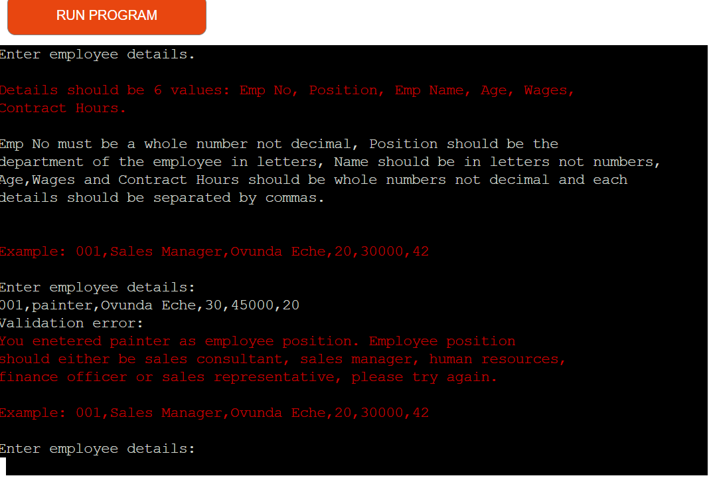
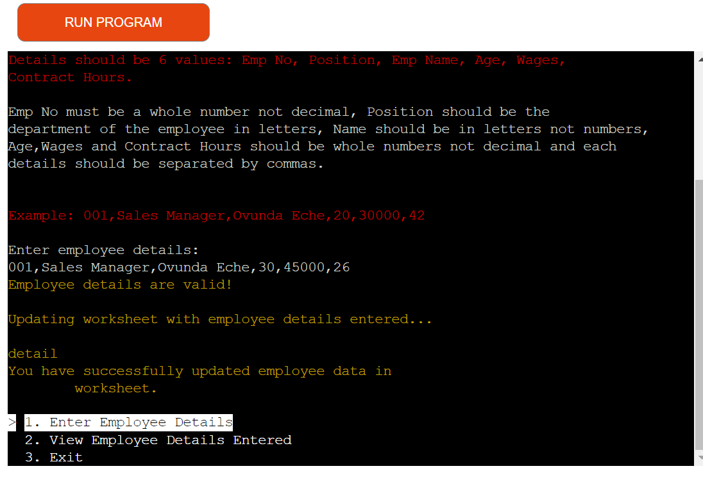

# OYISTRA-STAFF-DATA


  Oyistra Staff Data is a website designed for the collection of employees details.

  Employee details ranges from the employee numbers, positions, names, wages, ages and contract hours.
  Below are the links to oyistra-heroku where employee details are entered and oyistra-spreadsheet where details are stored.

[oyistra-heroku-link](https://oyistra-staff-data-3f59f12d77b3.herokuapp.com)

[oyistra-spreadsheet-link](https://docs.google.com/spreadsheets/d/1kHBdajrLnGRutdMd_iQ3cj9XT7uqmDMTrZvOMFGT_Bw/edit?gid=0#gid=0)

## How to access the oyistra staff data:

- Enter the [link](https://oyistra-staff-data-3f59f12d77b3.herokuapp.com/) alternatively you can also copy the link: `https://oyistra-staff-data-3f59f12d77b3.herokuapp.com` and paste it in the browser.
- Wait for the page to load and then you click 'RUN PROGRAM'.
- Choose from the options displayed.
1.  Enter employee details.
2.  View employee details entered.
3.  Exit.

## Users experience
- As a user what comes to your mind at first is to understand what oyistra staff data entails.
- How to key in the necessary details required as a user.
- How to view details entered.
- How to exit the program once the valid details has been entered.

## Features

- **When the program is loaded**

- The user will be ushered in with a welcoming message.
- - Shows the terminal menu with three options:

    1. Enter Employee Details;

    1. View Employee Details Entered;

    1. Exit;


The user can manipulate the terminal menu with the arrow keys to choose an option and the enter key to confirm the choice.

- **When the user chooses "Enter Employee Details**

The User will see instructions with an example of how to enter empolyee details and where to enter employee details.


- **When the user enters invalid employee details**

When the user enters details that is not equal to six, the user will see an error message and a provision to re-enter employee details.


When the user enter words in place of numbers for Emp No, the user will see an error message and a provision to re-enter employee details.


When a user enters numbers in place of words for Position, the user will see an error message and a provision to re-enter employee details.


When a user enters numbers in place of words for Name, the user will see an error message and a provision to re-enter employee details.



When the user enter words in place of numbers for Age, the user will see an error message and a provision to re-enter employee details.


When the user enter words in place of numbers for Wages, the user will see an error message and a provision to re-enter employee details.


When the user enter words in place of numbers for Contract Hours, the user will see an error message and a provision to re-enter employee details.


- **When the user enters valid details**

The user will see a message of employee details are valid and updating of worksheet.
Below the validatory message, the user can find the terminal menu with the options to enter employee details, view employee details or exit.



- **When the user chooses "View Employee Details Entered"**

The user sees the details of all employees data that has been entered in the spreadsheet.
Below the etails of all employees data that has been entered, the user can find the terminal menu with the options to enter employee details, view employee details or exit.


- **When the user chooses "Exit"**

The user will see a goodbye message, and the program will be stopped.


## Technologies Used

### Language:

- [Python 3.8.5](https://www.python.org/downloads/release/python-385/)

### Frameworks/Libraries and Tools:
#### Python modules/packages:

##### Third-party imports:

- [Simple Terminal Menu](https://pypi.org/project/simple-term-menu/) was used for the implementation of menu.
- [Colorama](https://pypi.org/project/colorama/) was used to add colors and styles to the project.

#### Other tools:

- [Gitpod](https://gitpod.io/workspaces/) was used as the main tool to write and edit code.
- [GitHub](https://github.com/) was used to host the code of the website.
- [heroku.com](https://www.heroku.com/) was used for the deployment of project.
- [am i responsive](https://ui.dev/amiresponsive) was used to screenshot devices for responsive design for README purpose.

## Bugs

### Solved bugs
1. The function ```view_employee_details_entered``` did not give the correct list of employee detials entered. It was duplicating the list with increase from one to six list of lists.

 - *Solutions:* I added [-1] to the pprint(columns) and it printed the correct output of lists items.

     ```python
     def view_employee_details_entered():
    """Collects columns of employee details from data worksheet and returning the datas as a list of lists."""
    detail_worksheet = SHEET.worksheet("data")
    columns = []
    for ind in range(1, 7):
        column = detail_worksheet.col_values(ind)
        columns.append(column)
        pprint(columns[-1])
    ```

2. The method ```if not details[].isalpha()``` was raising ValueError when alphabets was entered with space.

  - *Solutions:* I added a function ```is_alpha_or_space(string)```. Instead of checking if the string isalpha(), we'll check if our function is_alpha_or_space(), it returns false when we pass the string to it and also updated the use in the function ```validate_data(details)```

  ```python
  is_alpha_or_space(string):
    for char in string:
        if not char.isalpha() or char.isspace():
            return False
        return True
  ```
  ```python
  if not is_alpha_or_space(details[])
  ```

### Unsolved Bugs

  - None.