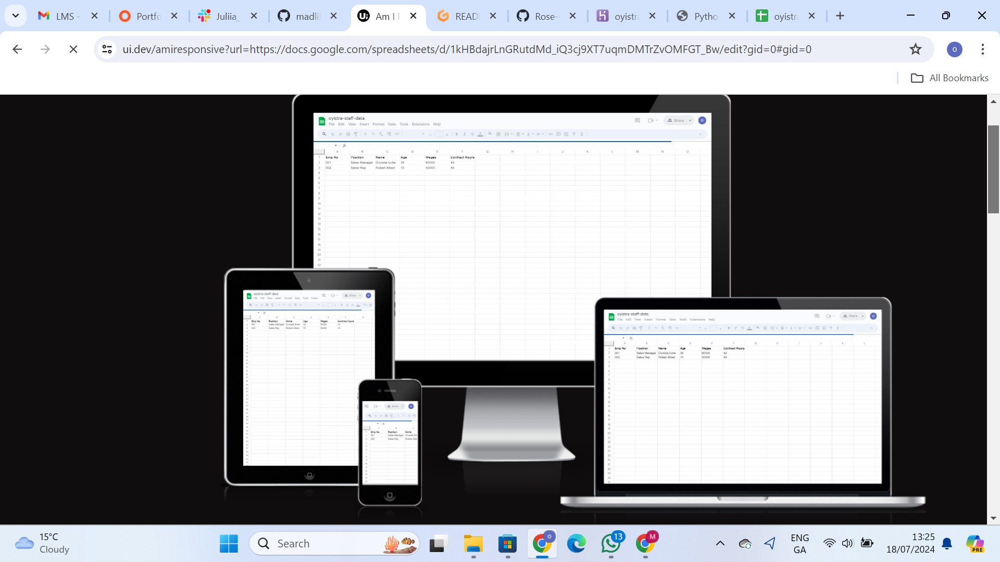

# OYISTRA-STAFF-DATA

  Oyistra Staff Data is a website designed for the collection of employees details.

  Employee details ranges from the employee numbers, positions, names, wages, ages and contract hours.
  Below are the links to oyistra-heroku where employee details are entered and oyistra-spreadsheet where details are stored.

[oyistra-heroku](https://oyistra-staff-data-3f59f12d77b3.herokuapp.com/) [oyistra-spreadsheet](https://docs.google.com/spreadsheets/d/1kHBdajrLnGRutdMd_iQ3cj9XT7uqmDMTrZvOMFGT_Bw/edit?gid=0#gid=0)

## How to access the oyistra staff data:

- Enter link [link](https://oyistra-staff-data-3f59f12d77b3.herokuapp.com/) alternatively you can also copy the link: `https://oyistra-staff-data-3f59f12d77b3.herokuapp.com` and paste it in the browser.
- Wait for the page to load and then you click 'RUN PROGRAM'.
- Choose from the options displayed.
- Enter employee details.
- View employee details entered.
- Exit.

